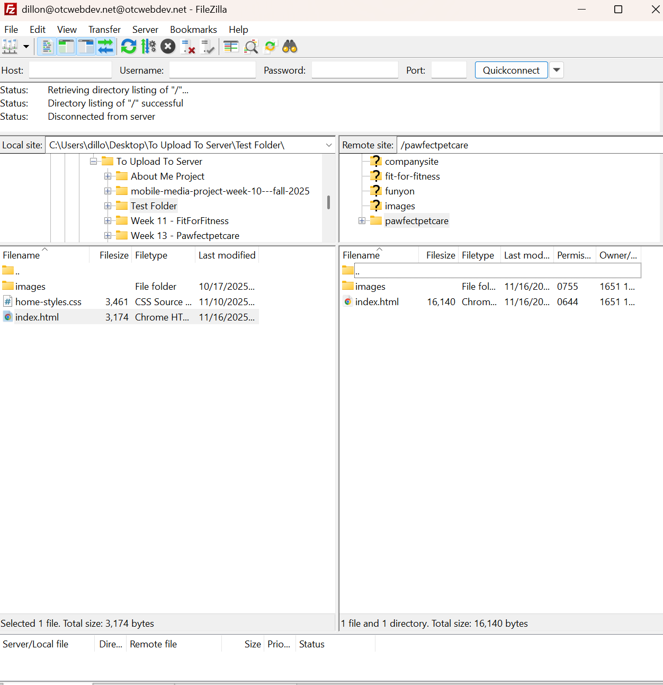

Your full name, project title, a short description of the site, a link to your live project URL and a screenshot of your homepage (the index.html page in your ROOT directory)
<!--Dillon Bishop-->
<!-- Contains pics from friends and an ai exterior of a vet style building-->
<!--https://otcwebdev.net/25Fall/dillon/pawfectpetcare/index.html-->
